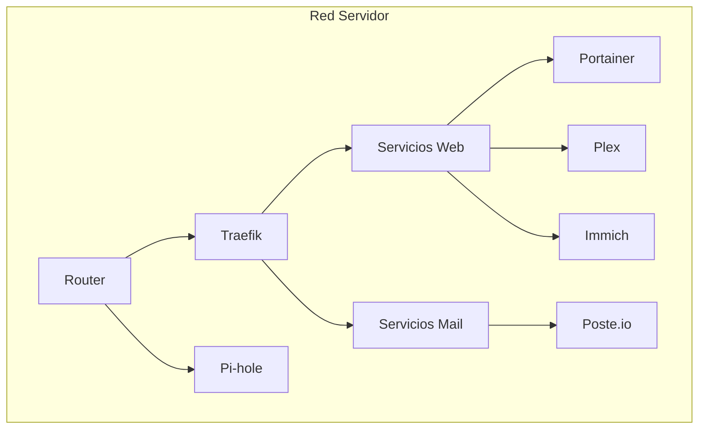
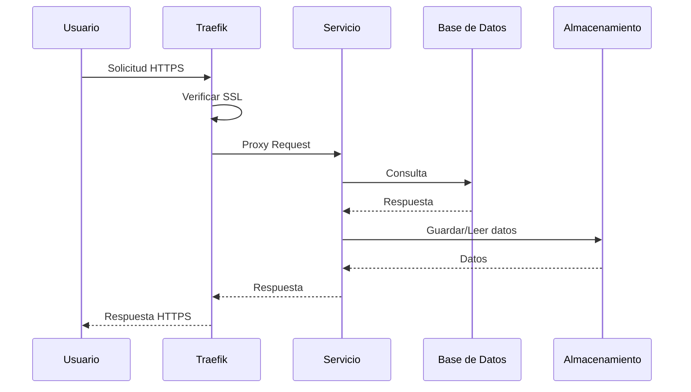
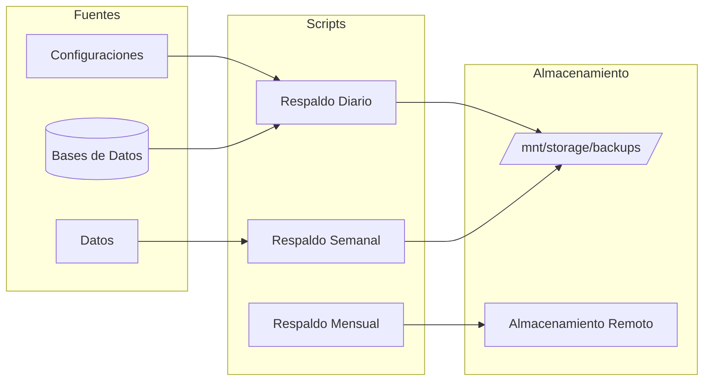
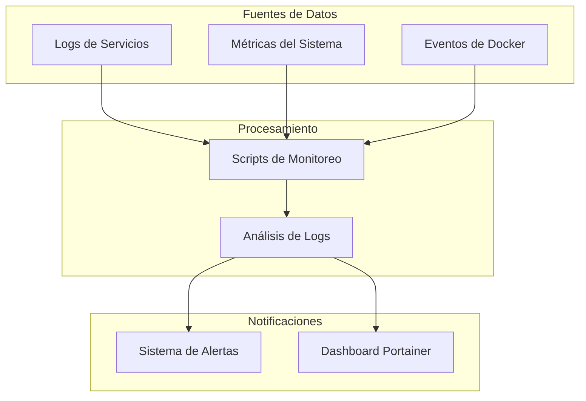

# Diagramas de Arquitectura del Servidor

## Diagrama de Red



## Flujo de Datos



## Estructura de Red

```mermaid
graph TB
    subgraph Red Externa
        Internet((Internet))
        CF[Cloudflare]
    end
    
    subgraph servidor-net
        TR[Traefik]
        PH[Pi-hole]
        
        subgraph Servicios Web
            IM[Immich]
            PL[Plex]
            PO[Portainer]
            PS[Poste.io]
        end
        
        subgraph Servicios Backend
            DB[(Bases de Datos)]
            RD[(Redis)]
            ML[Machine Learning]
        end
        
        subgraph Automatización
            TS[Transmission]
            FG[Flexget]
        end
    end
    
    Internet --> CF
    CF --> TR
    TR --> Servicios Web
    Servicios Web --> Servicios Backend
```

## Sistema de Respaldos



## Monitoreo y Alertas


